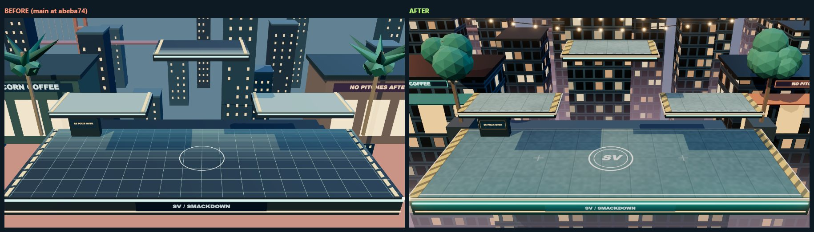
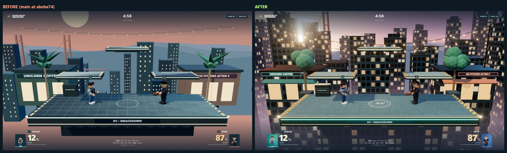
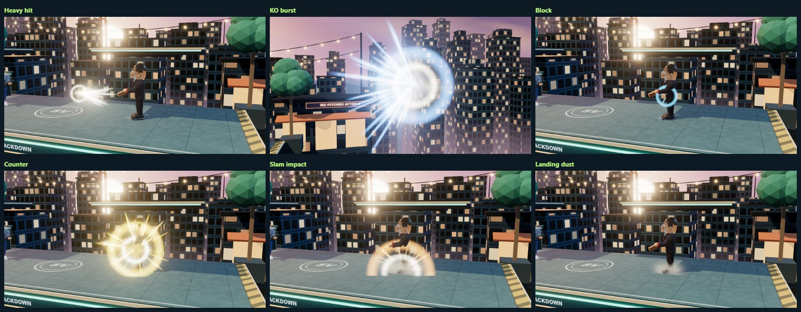

# Arena graphics pass

This pass fixes the flicker visible in the Arena menu and in matches, and rebuilds the way Arena looks: lighting, materials, sky, three distinct arenas, finished-looking fighters, combat effects, and a cleaner menu and HUD. It changes how Arena is **drawn**. The simulation (`Simulation.ts`, move and fighter definitions, collision, grabs, CPU) is untouched, so the gameplay pass in [arena-gameplay-pass.md](arena-gameplay-pass.md) behaves exactly as before. Classic (`?classic=1`) is untouched.

Base: `main` at `abeba74` (the merge of PR #16). Everything below was measured on the owner's laptop (details under [Measured results](#measured-results)) unless it says it was not.

## The cause of the flicker

Each platform was built from **two opaque boxes whose top faces were at exactly the same height** (`p.y`): a dark body and a lighter cap. Which one the depth buffer showed depended on the exact camera position, so as the camera moved by a fraction of a pixel the whole floor flipped between two colours. It was intermittent (some frames were clean), which is why a single screenshot can look fine. The same pattern existed on all 11 platforms across the three arenas.

A scene-graph audit now guards this permanently (`renderTestHelpers.ts`, run by `Stage.test.ts`): it looks for any two opaque, same-facing, axis-aligned faces on planes within 4 mm that overlap, across every mesh in each arena. The audit also found real defects in the first version of the new stage (ledge lamps sitting exactly on the coping's front plane) and several harmless same-colour overlaps, all fixed rather than tolerated. A guard test builds the original construction and confirms the audit would have caught it.

Other contributors fixed in the same pass:

| Defect | What it did | Fix |
| --- | --- | --- |
| Thin floor-line meshes | About 0.012 units tall, crossing each other, each also a shadow caster | Markings are painted into the platform's surface texture (mipmapped, anisotropic, sized from the platform record), so there is one exposed surface and no tiny shadows |
| Camera shake | Random noise added to the position that the next frame smoothed from, so it accumulated, never settled to zero, and left the look direction inconsistent | A smoothed base pose plus a separate, bounded, smooth, time-based offset applied as a pure translation; it ends at exactly zero, is discarded by pause and the menu, and has its own setting |
| Invulnerability blink | The fighter vanished on and off every 5 frames | The fighter stays visible; a slow accent-colour pulse and a ground halo show protection. The simulation's protection is unchanged |
| Raw positions | The camera, contact shadows and floating labels used simulation positions while the model was interpolated; projectiles stepped | One interpolated position per fighter per display frame is shared by the model, camera, shadow, label and effects; projectiles and move progress are interpolated too |
| Portraits | The main renderer was resized to 224 x 224 and back to take them | Drawn into an offscreen target through the same output transform, with the renderer's state untouched |
| First-use stalls | The first jump, hit, shield or projectile built a shader mid-fight (a stall of 1 to 2 seconds measured) | Every material is compiled when a match is set up or the preset changes |

## What changed

**Stage (`Stage.ts`, `stageKit.ts`, `stageThemes.ts`, `staticBatch.ts`, `sky.ts`).** One slab per platform with a single top face at exactly `p.y`; a coping lip 3 cm below it, glow lines, ledge lamps and the fascia sign sit off the surface plane. Scenery is batched by material and shadow role: **36 to 45 meshes with 6 to 11 shadow casters per arena, against 239 to 253 and 186 to 195 before.** Only the foreground casts shadows; windows, paint, trim and the distant skyline do not. Each arena has its own sky (a gradient dome with a hot sun disc and halo, static cloud layers, stars at night), ridges that fade to haze, a three-band skyline that stays below the camera's horizon so the sky and sun show, and its own dressing: Castro Street (peach sunset, a distant bridge, café lights on curved cable, trees, a coffee counter, neon signs), Sand Hill Road (amber and gold, glass towers, a polished turning gold sculpture, topiary), Palo Alto Launch Night (violet twilight, cyan technology lights, a gantry and a lathed rocket, server racks with LED rows). The tower the stage stands on fades into the haze below it through a height-based fog on scenery only.

**Lighting and materials.** Warm key, cool hemisphere fill, a cool rim and a warm sun rim, per arena. Material classes have believable roughness and metalness (rough cloth, non-metal skin, polished tech). A procedural environment (sky gradient, sun, two softboxes) is rendered once per arena through PMREM and applied only to surfaces that show reflections (fighters, props, gold, glass, polished metal), not to the whole scene.

**Post-processing and anti-aliasing (`post.ts`).** Scene, restrained HDR bloom, then one `OutputPass` that applies tone mapping and the sRGB transform. The scene target is half float and multisampled when the GPU supports it, with SMAA after the output pass as the fallback; support is checked, not assumed. The sky shader includes the same tone-mapping and colour-space chunks, so the sky gets exactly one display transform on both the direct and post paths. Bloom only reacts to values above about 1.15 in linear light, which is only the named emissives (neon, string lights, projectile cores, impacts), so faces, shirts and platform paint stay crisp. No vignette, grain, aberration or motion blur.

**Fighters (`FighterRig.ts`, `rigParts.ts`).** Same six characters, palettes and accessories, with smooth lathed torsos and heads, tapered limbs with real joints, hands with thumbs, shoes with soles, per-character hair, clothing and signature props, eyes, brows and a mouth that opens when hit or striking. Static parts are merged per joint and material. Walking is driven by distance actually travelled, jumps tuck and spread with vertical speed, and transitions between states ease while move poses stay exact on their own frames. Grabs attach the held fighter to the captor's hands visually (the simulation positions are not touched). The shield is a fresnel shell with a localized ripple where it was hit.

**Combat effects (`effects.ts`, `trails.ts`).** Driven by the real simulation events and scaled by hit strength and launch speed: tight sparks for light hits, directional bursts and streaks for heavy ones, a gold counter shockwave, a ground shockwave dome for slams, landing and jump dust, a distinct throw-release cue, a KO burst at the blast boundary in the fighter's own colour, and trails behind launched fighters and projectiles (tablet glint, briefcase streak, bottle droplets, fluttering resumes and bills, rocket exhaust and smoke). Everything is two instanced draw calls plus one shared ribbon geometry, integrated on the GPU from spawn data in fixed-size buffers whose capacity is set by the preset.

**Menu and HUD (`App.ts`, `theme.css`).** The menu camera drifts inside a defined envelope and the picture is shifted so the two showcase fighters sit beside the title; portrait screens shift it down instead. Selection cards have accent backgrounds, role labels and clear selected, player and hover states. The HUD panels take the fighter's accent colour, damage bumps briefly when it rises, stock pips animate, floating labels follow the drawn position and stick to the screen edge with an arrow when a fighter is off screen, and countdown, timer, damage, stocks, shield, buff and toast text are written only when their value changes. Preferences include Graphics, Reduced motion and Camera shake.

## Graphics presets

| Preset | Shadows | Pixel ratio cap | Anti-aliasing | Bloom | Effects (glow / dust / trails) |
| --- | --- | --- | --- | --- | --- |
| **High** | 2048, stable fitted volume | 1.5 | 4x MSAA on a half-float target (SMAA if unsupported) | full-resolution chain, strength 0.30 | 420 / 160 / 8 |
| **Balanced** | 1024 | 1.25 | 2x MSAA (SMAA if unsupported) | half-resolution chain, strength 0.24 | 240 / 96 / 4 |
| **Performance** | none (soft contact shadows, stronger) | 1.0 | the canvas's own MSAA, no offscreen pipeline | none | 120 / 48 / 2 |

The preset is only ever changed by the player. Nothing reacts to slow frames. The one exception to "the player chooses" is a first-run default: if the browser reports a software rasterizer (SwiftShader, llvmpipe, a basic driver) and no preset has ever been saved, the game starts on Performance, because the other presets cannot hold a playable rate there. Settings live under the existing `svs-arena-v1` key; the old "High quality shadows" flag is migrated (on becomes High, off becomes Performance) and is still written so an older build reading the same storage behaves sensibly. Reduced motion (which defaults to the system preference) calms ambient scenery and the busiest effect motion, and Camera shake is a separate switch.

## Measured results

**Environment.** Windows 11 Home (10.0.26200), Intel Core i7-13700H, 16 GB RAM, NVIDIA GeForce RTX 4070 Laptop GPU (driver 32.0.16.1692; an Intel Iris Xe iGPU is also present and was not used). Chromium from Playwright 1.63, driven through ANGLE on Direct3D 11 with `--use-angle=d3d11 --force_high_performance_gpu --ignore-gpu-blocklist`, headless. Node 22.23.

**Flicker.** The measurement is the mean brightness of the same patch of a platform top while the camera orbits about half a world unit (48 positions per sweep; 60 frames for the live menu). A stable surface keeps a steady brightness; coincident faces swing it. (`scripts/arena-evidence.mjs`, `scripts/lib/surface.mjs`.)

Brightness is on a 0 to 255 scale. "Range" is the largest minus the smallest patch brightness across the sweep; "change" is the mean difference between consecutive positions. The ranges are over the three arenas.

| Region | Before: range / mean change per step | After: range / mean change per step |
| --- | --- | --- |
| Main floor, 1x scale | 60 / 14.6 | 0.2 to 4.2 / 0.02 to 1.8 |
| Main floor, 2x scale | 58 / 14.1 | 0.1 to 3.8 / 0.02 to 0.7 |
| Upper platform, 1x scale | 81 to 118 / 19 to 35 | 0.3 to 1.8 / 0.04 to 0.26 |
| Upper platform, 2x scale | 65 to 118 / 21 to 35 | 0.2 to 2.2 / 0.02 to 0.27 |
| Live menu orbit (the real menu camera, no override) | 67 / 16.2 | 0.7 / 0.02 |

The larger values after (the Palo Alto floor) come from the painted launch-pad lines and chevrons crossing the measured patch, not from instability: the floor is the same colour in every frame and a painted line passes through the patch. The sweep also saves the worst frame of each run (the one whose brightness is furthest from the median). Before, that frame is the whole floor gone dark navy and striped; after, it is indistinguishable from the others (see [Evidence](#evidence)).

**GPU time and throughput (1920 x 1080, 1x pixel ratio, RTX 4070 Laptop).** Measured with GPU timer queries (`EXT_disjoint_timer_query_webgl2`) wrapped around the real render call, in the real animation loop, after a 6 second warm-up; each figure is the median of three 4 second trials (`scripts/arena-perf.mjs`). Frame-interval timing alone is not trustworthy here: vsync hides cost, one shader-compile stall skews any mean, and a laptop GPU downclocks under a light load. So the first table runs with vsync and the frame limiter off (the GPU stays at full clocks) and the second is the normal 60 Hz loop.

Full clocks, uncapped (the cost of the work):

| Case | GPU ms p50 | GPU ms p95 | CPU ms in render | frames/s | worst frame ms | draw calls | triangles |
| --- | --- | --- | --- | --- | --- | --- | --- |
| **Before (main at abeba74)** | 1.02 | 1.09 | 3.20 | 227 | 24 | 569 | 38,665 |
| High | 1.40 | 1.50 | 3.80 | 227 | 8 | 262 | 128,595 |
| High, 1.5x pixels | 2.79 | 3.00 | 3.60 | 242 | 8 | 262 | 128,595 |
| High, Sand Hill Road | 1.35 | 1.58 | 3.60 | 231 | 25 | 257 | 124,519 |
| High, Palo Alto Launch Night | 1.27 | 1.46 | 3.40 | 256 | 10 | 234 | 99,773 |
| Balanced | 1.37 | 1.56 | 3.90 | 219 | 8 | 262 | 127,899 |
| Balanced, 1.25x pixels | 1.53 | 1.60 | 3.90 | 221 | 8 | 262 | 127,899 |
| Performance | 0.65 | 0.75 | 2.40 | 343 | 7 | 156 | 76,417 |
| High, 1280 x 720 | 1.19 | 1.42 | 3.50 | 249 | 8 | 262 | 128,595 |

Normal 60 Hz loop (the GPU idles between frames and downclocks, so its time per frame reads higher than the work warrants):

| Case | GPU ms p50 | GPU ms p95 | CPU ms in render | frames/s | worst frame ms |
| --- | --- | --- | --- | --- | --- |
| **Before (main at abeba74)** | 3.72 | 4.62 | 3.20 | 60 | 17 |
| High | 5.17 | 5.22 | 1.10 | 60 | 17 |
| High, 1.5x pixels | 5.72 | 5.78 | 1.20 | 60 | 17 |
| High, Sand Hill Road | 5.31 | 5.36 | 1.10 | 60 | 17 |
| High, Palo Alto Launch Night | 5.12 | 5.17 | 1.10 | 60 | 17 |
| Balanced | 5.29 | 5.31 | 1.20 | 60 | 17 |
| Balanced, 1.25x pixels | 5.44 | 5.48 | 1.20 | 60 | 17 |
| Performance | 4.27 | 5.22 | 1.00 | 60 | 17 |
| High, 1280 x 720 | 4.07 | 6.74 | 1.30 | 60 | 17 |

Reading them:

- **High costs about 0.4 ms more GPU time per frame than the old renderer** (1.40 against 1.02 at full clocks) for a much richer picture, and 2.8 ms at 1.5x pixels. A 60 Hz frame is 16.7 ms, so every preset has a large margin on this laptop, and every case holds 60 frames per second with a worst frame of 17 ms (one refresh interval).
- **Draw calls fall by more than half** (569 to 262; Performance 156) because scenery is batched. **Triangles rise about 3.3 times** (38,665 to 128,595; counted across the shadow, scene and post passes) because the fighters, props and scenery carry far more geometry (lathed heads and torsos, tapered limbs, hands, hair, rounded boxes). Neither is the bottleneck: the cost is pixels.
- Repeat runs of the same case differ by roughly 5 to 10 percent (the baseline read 1.08 ms and 214 frames per second when measured earlier in the session and 1.02 ms and 227 now); the worst-frame column is a single sample and includes the occasional OS hiccup (25 ms once in the Sand Hill run). Read the comparisons to that precision.
- These are one machine's numbers. Nothing here says how Arena runs on a different GPU.

**Draw statistics.**

| | Before | After (High) |
| --- | --- | --- |
| Stage meshes | 239 to 253 | 36 to 45 (Castro Street 45, Sand Hill Road 38, Palo Alto 36) |
| Stage shadow casters | 186 to 195 | 6 to 11 (11, 11, 6) |
| Whole-frame draw calls, three arenas | 538 to 569 | 231 to 262 |
| Geometries resident | 21 to 53 | 126 with one arena built, 205 once all three have been visited |
| Textures resident | 6 to 7 | 37 with one arena built, 73 once all three have been visited (painted surfaces, facades, signs, clouds, sprites, the reflection maps and the post-processing targets) |

Resource counts rise during the first pass through all three arenas and then stay flat; `graphics.spec.ts` pins that, and also checks that cycling presets, resizing, opening and closing matches and switching arenas repeatedly do not accumulate geometries, textures or programs.

**Software rendering.** A CPU rasterizer (SwiftShader) is much slower than a GPU, and the new pictures are heavier per pixel than the old. At 1280 x 720 the old renderer ran at about 16 fps in software and the new Performance preset runs at about 8 fps; High is slower still. That is why a software rasterizer starts on Performance and why the browser tests give software runs longer limits. It says nothing about the target laptop, where all three presets are far inside a 60 fps budget; it is listed so the difference is not a surprise on a machine with no hardware acceleration.

**A cost bug found and fixed during this pass.** The first version of the effect layer initialised every unused particle with a negative lifetime, so each was drawn as a huge invisible additive quad: 420 full-screen blends per frame, which cost 12 to 18 ms of GPU time at 1080p. It was found by timing each pass and then isolating the effect batches with GPU timer queries, fixed, and pinned by a unit test (`effects.test.ts`). The numbers above are after that fix.

## Verification

Everything below ran on the final source and test files, in one sequence, on the laptop described above. The Arena bundle the pictures and clips came from is byte-identical to the one these suites ran against. "GPU" runs set `SVS_GPU=1` (the RTX 4070 through ANGLE on Direct3D 11); "software" runs use the default SwiftShader CPU rasterizer, which is how a machine with no hardware acceleration would run it. `SVS_SANDBOX_DEVICES=1` swaps the OS controller device for synthetic state, as the existing Arena specs always did. `SVS_PORTABLE=1` runs the same specs against the built `PLAY.html` opened as a file.

FILL-RESULTS-TABLE

**What the new Arena rendering tests cover** (`tests/arena/graphics.spec.ts`, plus unit tests beside the code):

- **Geometry and cost.** Every live platform slab matches the simulation record (top, bottom, width, centre); scenery batching and whole-frame draw and triangle ceilings; the High preset really runs the HDR, multisampled, bloom and shadow pipeline. Unit tests build every arena's scene graph and audit it for coincident faces, and prove the audit would have caught the original construction.
- **No surface flicker.** A slow camera sweep over the floor and an upper platform of each arena at 1x and 2x scale, the live menu orbit, identical frames from a frozen state, and a speckle check on the painted floor. Unit tests run the same coincident-face audit on all six fighters (hair, glasses, clothing, props).
- **Invulnerability.** The fighter stays visible with a gentle pulse while the simulation's protection counts down unchanged; a respawning fighter is hidden until they return, then protected and visible.
- **Attached visuals.** The model, label, contact shadow and effects share one interpolated position for both slots (also while walking); a held opponent is drawn in the captor's hands through a real grab, pummel and throw; every move, shield, grab, throw, KO and respawn draws without errors; launch and projectile trails follow the drawn path.
- **Timing.** Pause holds the picture still; hitstop freezes fighters and trails but not sparks; training frame advance moves exactly one frame; hiding the tab pauses and leaves no shake.
- **Sizing and settings.** Resizing; the menu's title, buttons, location tag and footer at six window sizes; a static and a live change of device scale (browser zoom); fullscreen and menu/match transitions; each preset chosen from the settings control; cycling presets without leaking; offscreen portraits with the right colour that leave the renderer untouched.
- **Stability.** Stage, roster and heavy-effect churn reaches a steady resource count; the first hit, shield, projectile and trail never stall a frame; all three arenas and all six fighters render; the shadow comparison hook changes only the shadows.
- **Offline.** `PLAY.html` with HTTP and HTTPS blocked: the default run, and a test that exercises every preset, the portraits and the effects, with no remote request, console error or shader warning.

## Known notes and limits

- **`X4122` warning.** On Direct3D 11 the first compile logs one HLSL precision note from three.js's own PMREM shader (`PMREMGGXConvolution`). It is a warning from library code, not an error, and the browser tests whitelist exactly that message; every other console warning or error fails them.
- **Not tested here:** physical controllers; audible sound; frame rate on any machine other than this laptop; displays above 60 Hz (the simulation and interpolation are written for them and tested at several rates, but the owner's display refresh rate was not exercised); native Windows packaging and the Electron wrapper; macOS and Linux; browsers other than Chromium; human judgement of balance or taste. The visual review was done by looking at screenshots and clips from this machine.
- **Hitboxes in the training overlay** are drawn at the simulation's own positions for the current tick, deliberately not interpolated, so they stay semantically accurate; the model can differ from them by up to one tick of travel.
- **Held opponents** are nudged visually to meet the captor's hands (at most about half a unit); the simulation positions and hit volumes are untouched.
- **Reflections** are applied per material to the surfaces that show them. Adding new polished scenery means registering its material (`StageKit.mat(..., { env: true })` or `reflect()`), otherwise it will not reflect.
- **Adding scenery** must keep `Stage.test.ts` green: embed a piece into what it rests on, or offset a decal by at least 1 cm; the coplanar-face audit fails otherwise.
- Arenas and their reflection maps are built once and kept for the life of the renderer (at most three of each), so resource counts rise during the first pass through all three arenas and then stay flat.

## Evidence

Everything is in [evidence/arena-graphics/](evidence/arena-graphics/). Each before/after picture comes from the same scripted harness on the same machine (`scripts/arena-evidence.mjs`): "before" is a build of `main` at `abeba74`, "after" is this branch, same viewport, same scene, same camera. The side-by-side sheets are made by `scripts/arena-compare.mjs`.

**The flicker, worst frame of a half-unit camera sweep (Castro Street).** The frame whose floor brightness is furthest from the median. Before, the floor has flipped to the dark striped body; after, it is the same floor as every other frame.



**Castro Street in a match, before and after.**



**Combat effects**, each photographed at a fixed instant of the effect (heavy hit, KO burst, block, counter, slam impact, landing dust):



| Picture | What it shows |
| --- | --- |
| [menu-1920x1080-before-after.jpg](evidence/arena-graphics/menu-1920x1080-before-after.jpg), [menu-1227x832-before-after.jpg](evidence/arena-graphics/menu-1227x832-before-after.jpg) | The menu at full HD and at a smaller laptop-window size |
| [menu-viewports.jpg](evidence/arena-graphics/menu-viewports.jpg) | The menu after the change at four sizes (1080 x 762, 1227 x 832, 2560 x 1080 ultrawide, 420 x 860 narrow). A browser test (`graphics.spec.ts`) checks six sizes, those four plus 1280 x 720 and 1920 x 1080: the title, buttons, location tag and footer are inside the window and the buttons are not covered |
| [selection-1280x720-before-after.jpg](evidence/arena-graphics/selection-1280x720-before-after.jpg) | Character select: accent-coloured cards, role labels, the Graphics setting |
| [arena-castro-street-before-after.jpg](evidence/arena-graphics/arena-castro-street-before-after.jpg), [arena-sand-hill-road-before-after.jpg](evidence/arena-graphics/arena-sand-hill-road-before-after.jpg), [arena-palo-alto-launch-night-before-after.jpg](evidence/arena-graphics/arena-palo-alto-launch-night-before-after.jpg) | Each arena in a match with the HUD |
| [floor-flicker-worst-frame-castro-before-after.jpg](evidence/arena-graphics/floor-flicker-worst-frame-castro-before-after.jpg), [-sand-hill-](evidence/arena-graphics/floor-flicker-worst-frame-sand-hill-before-after.jpg), [-palo-alto-](evidence/arena-graphics/floor-flicker-worst-frame-palo-alto-before-after.jpg) | The worst frame of the floor sweep in each arena |
| [fighters-closeup.jpg](evidence/arena-graphics/fighters-closeup.jpg) | All six fighters in their arenas |
| [effects.jpg](evidence/arena-graphics/effects.jpg) | The six effect frames above |
| [before.webm](evidence/arena-graphics/before.webm), [after.webm](evidence/arena-graphics/after.webm) | Two 24 second clips of the same scripted session at 1280 x 720: the live menu, then a CPU match in each arena with Player 1 driven by the same key presses (`scripts/arena-video.mjs`). They are Playwright screencasts: they capture fewer frames per second than the page renders, so they show how the game looks and moves, not how fast it runs. The CPU answers differently each time, so the two matches are not identical fights |

To regenerate: build `dist` (and a baseline from `main` for "before"), then

```
node scripts/arena-evidence.mjs --label after --dir dist --out .scratch/evidence/after
node scripts/arena-compare.mjs --before .scratch/evidence/before --after .scratch/evidence/after --out .scratch/evidence/composites
node scripts/arena-video.mjs --dir dist --out .scratch/evidence/video/after.webm
node scripts/arena-perf.mjs --dir dist --matrix
```
